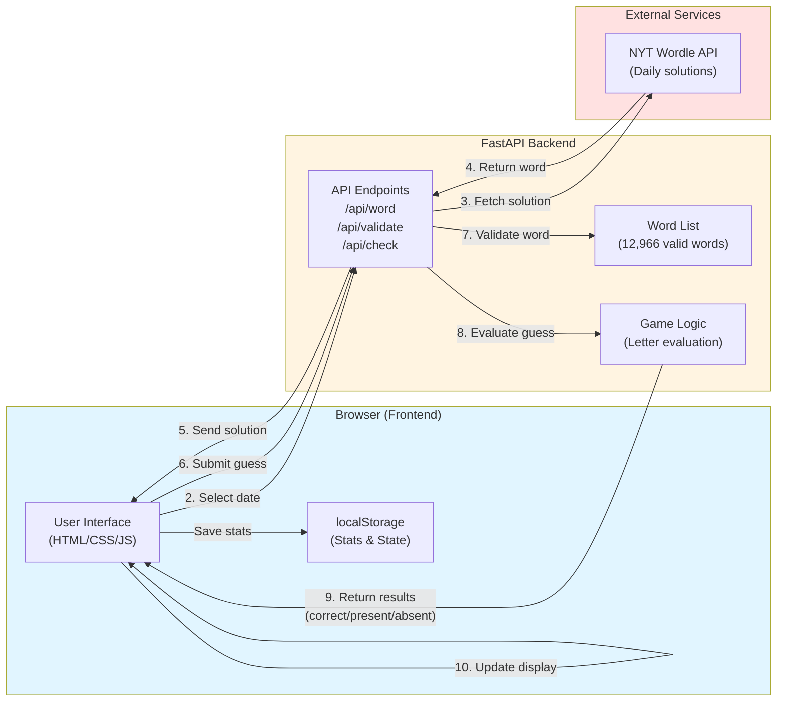

# Wordle Recreation Architecture

## Architecture Notes

**Frontend (Browser)**
- Single-page application (SPA) with vanilla JavaScript
- Manages game state, UI rendering, and animations
- Stores statistics locally in browser

**Backend (FastAPI)**
- Lightweight Python server
- Validates words against comprehensive word list
- Evaluates guesses using authentic Wordle algorithm
- Fetches daily solutions from NYT

**External Integration**
- NYT Wordle API provides official daily puzzle solutions
- Allows playing any historical puzzle from June 19, 2021 onwards

**Flow:**
1. User selects a date and plays the game
2. Backend fetches that date's solution from NYT
3. User submits guesses
4. Backend validates and evaluates each guess
5. Frontend displays results with tile animations
6. Statistics are saved locally in the browser
